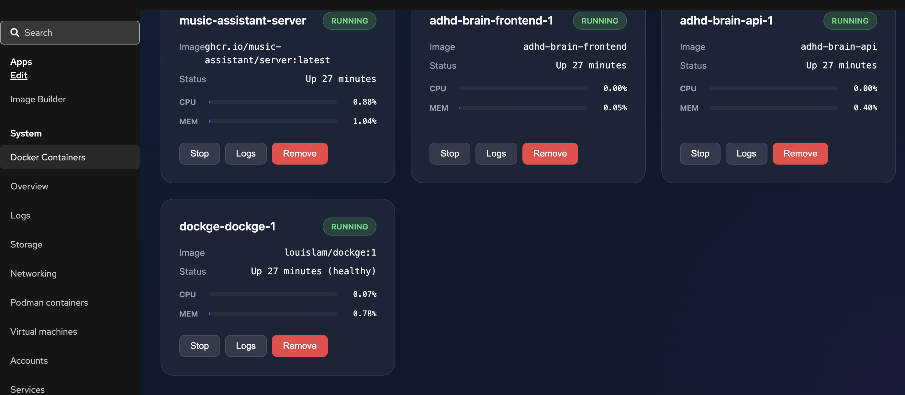
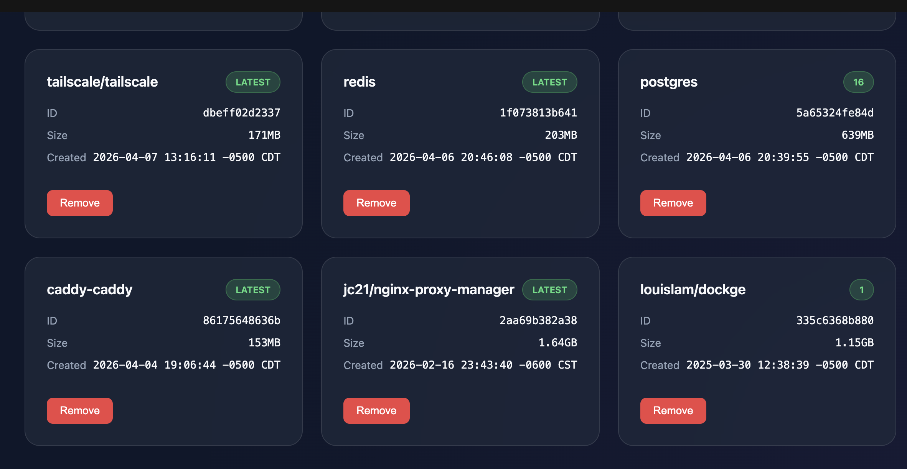

# 🐳 Cockpit Docker Management

A premium, high-performance Cockpit module for managing Docker containers and images with a modern, glassmorphic interface.



## ✨ Features

- **🚀 Real-time Monitoring**: Live CPU and Memory usage tracking for all containers.
- **📦 Container Control**: Start, Stop, and Remove containers with a single click.
- **🖼️ Image Management**: View and manage local Docker images, including size and creation date.
- **📜 Live Logs**: Interactive terminal-style log viewer with auto-refresh and auto-scroll.
- **💎 Premium UI**: Built with glassmorphism, dark mode, and smooth animations.
- **🛠️ Cockpit Integration**: Native look and feel within the Cockpit web console.

## 📸 Screenshots

### Images Management


### Real-time Stats
Live resource usage bars for every container.

## 🛠️ Installation

### Quick Start
Run these commands on your Linux node:

```bash
git clone https://github.com/flippinhutt/cockpit-docker.git
cd cockpit-docker
sudo make install
```

This will install the module to `/usr/share/cockpit/cockpit-docker`.

### Manual Installation
1. Copy the project directory to `/usr/share/cockpit/cockpit-docker`.
2. Ensure the files are world-readable.
3. Refresh Cockpit.

## 🔐 Permissions

The module runs commands via the logged-in Cockpit user. To manage Docker, ensure your user is in the `docker` group:

```bash
sudo usermod -aG docker $USER
```

*Note: You may need to log out and back in for changes to take effect.*

## 📋 Requirements

- **Cockpit** >= 120
- **Docker Engine**
- **Modern Browser** (for CSS Backdrop-filter support)

## 🤝 Contributing

Contributions are welcome! Feel free to open issues or submit pull requests.

---
*Created with ❤️ for the homelab community by [StreamHuts](https://streamhuts.com)*
